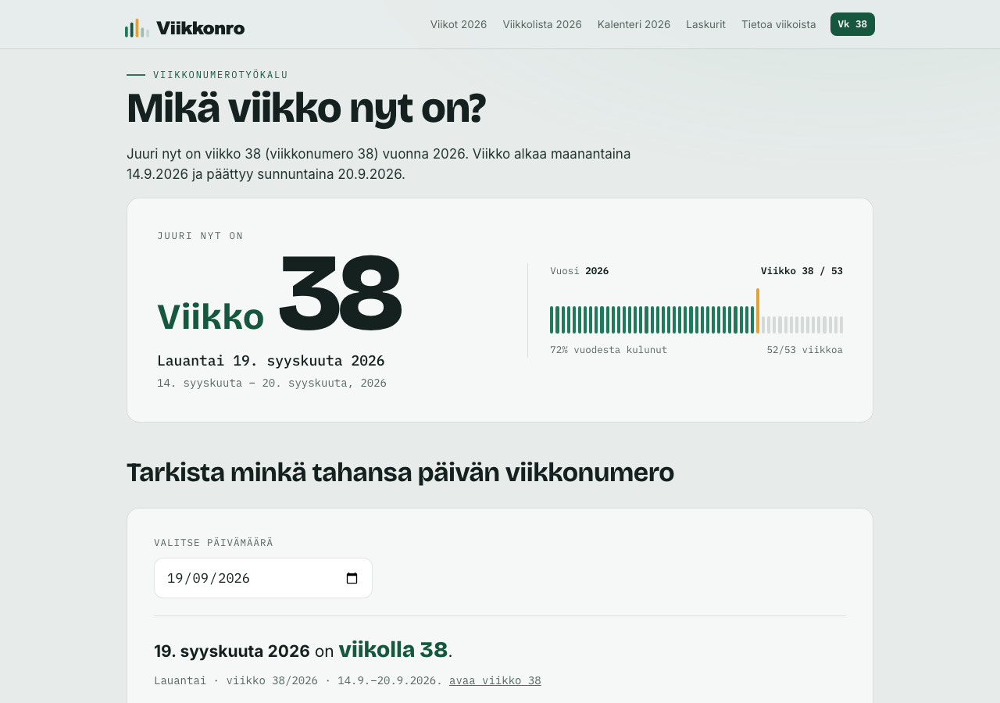
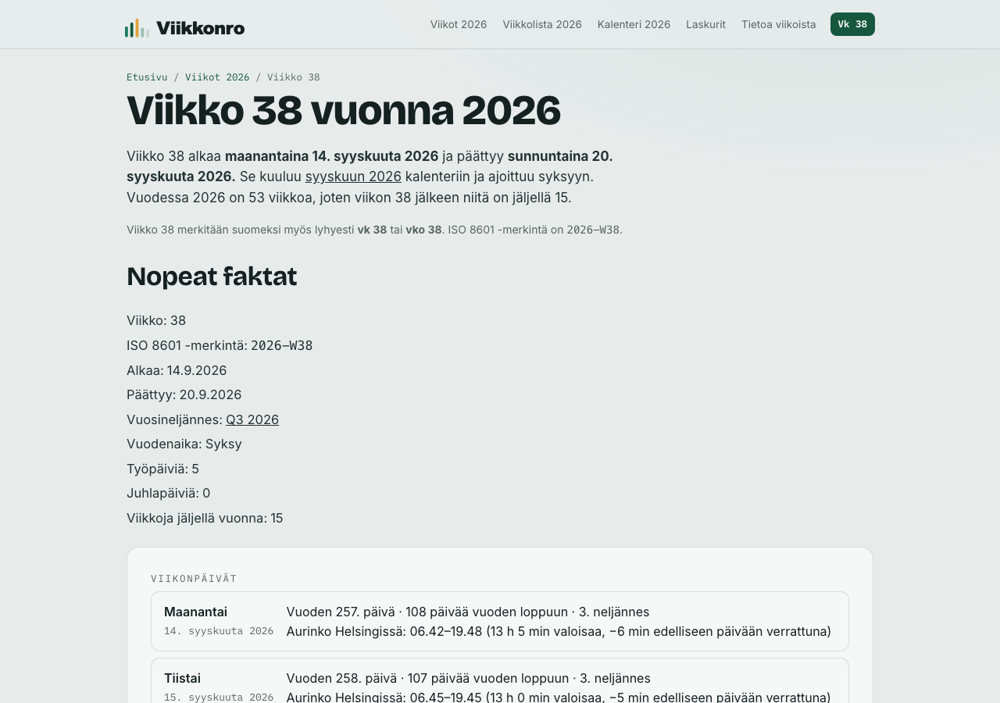
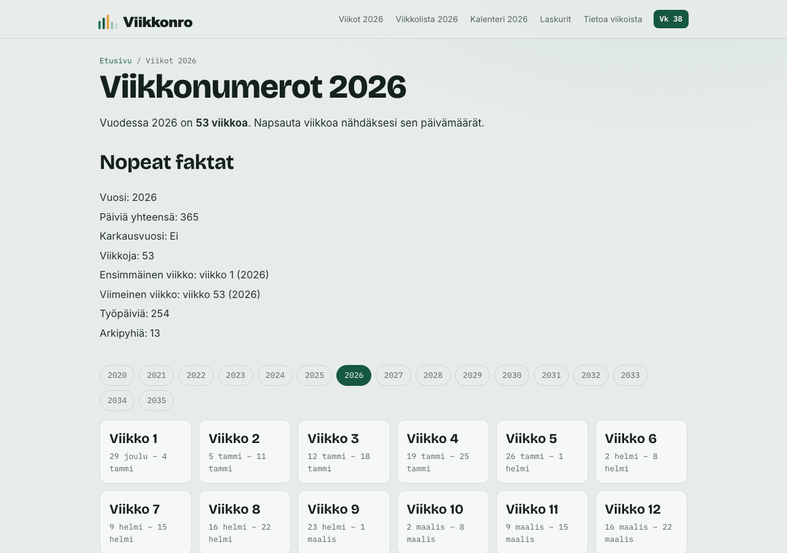
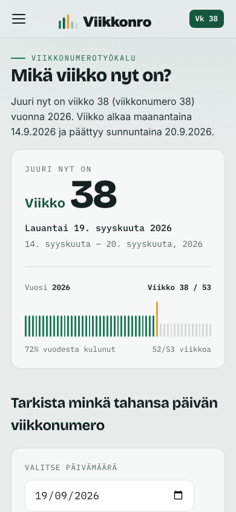

<p align="center">
  <a href="https://viikkonro.fi">
    <picture>
      <source media="(prefers-color-scheme: dark)" srcset="public/logo-horizontal-dark.svg">
      
    </picture>
  </a>
</p>

<p align="center">
  <strong>A lightweight Finnish calendar and ISO 8601 week number utility.</strong><br>
  Built for developers and everyday users. Open source, open data, easy to contribute to.
</p>

<p align="center">
  <a href="https://github.com/link2dawood/Viikkonro/actions/workflows/ci.yml"></a>
  <a href="LICENSE"></a>
  <a href="https://github.com/link2dawood/Viikkonro/issues?q=is%3Aissue+is%3Aopen+label%3A%22good+first+issue%22"></a>
</p>

<p align="center">
  <a href="https://viikkonro.fi"><strong>viikkonro.fi</strong></a> ·
  <a href="https://play.google.com/store/apps/details?id=fi.viikkonro.app">Android app</a> ·
  <a href="https://chromewebstore.google.com/detail/viikko-nro-%E2%80%93-viikkonumero/cljdpfclijdndkcphkgagcoodpdafajg">Chrome extension</a> ·
  <a href="https://viikkonro.fi/avoin-data">Open data</a>
</p>

---

**What week is it?** In Finland that is an everyday question, and [viikkonro.fi](https://viikkonro.fi) answers it: the current week number, the week of any date, and the calendars, holidays and working days built on top of that. Every page is prerendered to static HTML, so the answer is in the page source before any JavaScript runs. The same facts are published as free JSON data.

## Why this matters

Finland runs on week numbers. Schools, workplaces, shift rotas and public services schedule by them: "vko 38", "viikolla 40". Getting them right is harder than it looks.

Finnish week numbers follow **ISO 8601**: weeks start on Monday, and week 1 is the week containing the year's first Thursday. So:

- **Some years have 53 weeks**, not 52. 2020, 2026 and 2032 all do.
- **The last days of December can be week 1** of the next year. December 29, 2025 is in week 1 of 2026.
- **The first days of January can be week 53** of the previous year. January 1, 2021 is in week 53 of 2020.

Many calendar apps and quick scripts get these edges wrong, typically by assuming the week year equals the calendar year. This project gets them right, tests them, and makes the correct answer available to both people and programs.

## Who it's for

- **Everyday users** who need to know which dates "week 38" covers, or when the next public holiday falls
- **Planners, teachers and shift schedulers** working with Finnish week numbers, working days and school holidays
- **Developers** who need reliable Finnish calendar data: use the [JSON feeds](https://viikkonro.fi/avoin-data) directly, or read [`dateUtils.js`](src/components/dateUtils.js) for a tested ISO week implementation

## Screenshots

| Home page | Week page |
| --- | --- |
|  |  |

| Year overview | Mobile |
| --- | --- |
|  |  |

## Features

**Week numbers**
- The current ISO week, with its Monday to Sunday date range and how much of the year has passed
- Date to week and week to date lookups
- A page for every week (`/viikko-38-2026`), month (`/kuukausi-9-2026`), quarter (`/q3-2026`) and year (`/vuosi-2026`) from 2020 onward

**Calendars and days**
- Yearly calendars, including half year views, plus printable versions and PDF downloads
- Finnish public holidays, flag days and school holidays per year, each holiday with its own page
- Working days per year and per month, and a working days calculator
- Days between dates, weekday of a date, and more under [/laskurit](https://viikkonro.fi/laskurit)
- Name days, shown where licensed data is available

**Open data**
- Static JSON feeds under [`/data/`](https://viikkonro.fi/avoin-data) for weeks, months, quarters, years, holidays, flag days and working days, with no key and no rate limit
- An interactive [API playground](https://viikkonro.fi/api-playground)
- Machine readable summaries for AI systems: `llms.txt`, `llms-full.txt`, `ai-manifest.txt` and a knowledge graph

**Search and discoverability**
- Per page titles, descriptions, canonical URLs and schema.org JSON-LD
- A generated sitemap with image and PDF entries, plus Open Graph and Discover images for every major page

## Tech stack

- [React 19](https://react.dev) with [React Router 7](https://reactrouter.com)
- [Vite](https://vite.dev) for the client and SSR builds
- [Vitest](https://vitest.dev) for tests and [ESLint](https://eslint.org) for linting
- [`@vercel/og`](https://vercel.com/docs/og-image-generation) for images and [PDFKit](https://pdfkit.org) for PDFs, both at build time
- Hosted on [Vercel](https://vercel.com) behind [Cloudflare](https://www.cloudflare.com)

There is no backend. The contact form posts directly to [Web3Forms](https://web3forms.com) from the browser.

## Running locally

Requires **Node.js 22 or newer**. If you use [nvm](https://github.com/nvm-sh/nvm), `nvm use` picks the right version from `.nvmrc`.

```bash
git clone https://github.com/link2dawood/Viikkonro.git
cd Viikkonro
nvm use        # optional
npm ci
npm run dev
```

Then open the URL Vite prints, usually http://localhost:5173.

| Command | What it does |
| --- | --- |
| `npm run dev` | Start the Vite dev server with hot reload |
| `npm test` | Run the Vitest suite once |
| `npm run lint` | Run ESLint over the whole repo |
| `npm run build:spa` | Client build only. Fast, but skips prerendering |
| `npm run build` | Full production build: client build, SSR build, then `prerender.js` |
| `npm run preview` | Serve the built `dist/` folder locally |

`npm run build` is the build Vercel runs. It prerenders about 1,700 routes and generates thousands of images and PDFs, so it takes a few minutes. Use it whenever you change routing, page content, metadata or structured data. For everything else, `npm run build:spa` is enough.

### Environment variables

None are needed for local development or for the build. Two are optional:

| Variable | Used for |
| --- | --- |
| `VITE_WEB3FORMS_ACCESS_KEY` | Delivering the contact form. Without it, the form renders but does not send. |
| `SITE_ORIGIN` | The absolute origin used in canonical URLs and the sitemap. Defaults to `https://viikkonro.fi`. |

Put local values in `.env.local`, which is gitignored.

## Architecture

The site is a React single page app that is also **fully prerendered at build time**. There is no server at runtime.

```
npm run build
  │
  ├─ 1. vite build                     client bundle → dist/
  ├─ 2. vite build --ssr               entry-server.jsx → dist-server/ (temporary)
  └─ 3. node prerender.js
         ├─ renders every route in sitemapEntries() → dist/<route>.html
         ├─ injects per page <title>, meta, canonical and JSON-LD
         ├─ writes sitemap.xml, the llms-*.txt files and ai-manifest.txt
         ├─ writes the /data/ JSON feeds
         ├─ generates Open Graph and Discover images, and calendar PDFs
         └─ deletes dist-server/
```

A few things are useful to know before changing code:

- **Two entry points, one route tree.** `src/main.jsx` hydrates `AppRoutes` in the browser, and `src/entry-server.jsx` renders the same `AppRoutes` at build time.
- **Routes are single segment Finnish slugs** such as `/viikko-38-2026`. React Router cannot match two parameters inside one segment, so a `/:slug` catch all in `src/AppRoutes.jsx` dispatches them with regular expressions.
- **Metadata has one home.** Titles, descriptions, breadcrumbs, canonical URLs and the sitemap list all come from `src/data/seo.js`.
- **Week math has one home.** All ISO week logic lives in `src/components/dateUtils.js`. Import from it rather than reimplementing it.
- **Prerendered output is flat.** Pages are written as `dist/ukk.html`, not `dist/ukk/index.html`, which avoids redirect loops with the no trailing slash convention.
- **Only a rolling window is indexable.** Pages from the current year minus 2 to plus 4 are in the sitemap. Older and later years are still prerendered but marked `noindex`.

### Project layout

```
src/
  AppRoutes.jsx        route table and slug dispatcher
  pages/               one component per route
  components/          shared UI, plus dateUtils.js (ISO week math)
  data/                content and metadata modules, with their *.test.js files
prerender.js           the build time renderer and generator
public/                static files copied as is (robots.txt, llms.txt, .well-known/)
scripts/               maintenance scripts, not part of the bundle
docs/                  design specs and the SEO constitution
.github/workflows/     CI, the nightly rebuild and live site monitors
```

For the full picture, read [`CLAUDE.md`](CLAUDE.md) (architecture notes) and [`docs/SEO_CONSTITUTION.md`](docs/SEO_CONSTITUTION.md) (the rules any change must keep).

### Deployment

Vercel builds and deploys every push to `main`. A scheduled workflow triggers a rebuild every night so the current week shown on the home page never goes stale, and a separate workflow checks the live site shows the correct week.

## Contributing

Contributions of every size are welcome, from fixing a typo in the Finnish copy to adding a new calculator. **New here?** Start with an issue labelled [good first issue](https://github.com/link2dawood/Viikkonro/issues?q=is%3Aissue+is%3Aopen+label%3A%22good+first+issue%22). These are small, well scoped tasks with a clear definition of done.

The short version:

1. Fork the repo and create a branch from `main`
2. Make your change, then run `npm run lint` and `npm test`
3. If you touched routes, content or metadata, also run `npm run build`
4. Open a pull request and fill in the template

This site has strict rules for anything that affects search visibility, such as URLs, metadata and structured data. Please read [CONTRIBUTING.md](CONTRIBUTING.md) before opening a pull request, especially the section on SEO sensitive changes.

- [Contributing guide](CONTRIBUTING.md)
- [Code of Conduct](CODE_OF_CONDUCT.md)
- [Security policy](SECURITY.md)

## Roadmap

**Shipped**
- Week, month, quarter and year pages from 2020 onward
- Holidays, flag days, school holidays and working days
- Open JSON data feeds and the API playground
- English landing page at [/en](https://viikkonro.fi/en)
- Android app and Chrome extension

**Planned** (each has a design spec in [`docs/`](docs/))
- Embeddable widgets for other sites ([spec](docs/embeddable-widgets.md))
- A glossary of calendar and week terms ([spec](docs/glossary-system.md))
- Educational articles on how Finnish calendar conventions work ([spec](docs/educational-articles.md))
- A research center collecting sourced calendar facts ([spec](docs/research-center.md))
- Extending the prerendered range toward 2100 ([spec](docs/expansion-plan-2100.md))

**Waiting on others**
- Full name day coverage, which depends on a data licence (see below)

Have an idea? [Open a feature request](https://github.com/link2dawood/Viikkonro/issues/new?template=feature_request.md).

## License

The source code is released under the [MIT License](LICENSE).

The MIT License covers the code in this repository. It does not cover:

- **Name day data.** Finnish name day lists are compiled by the University of Helsinki Almanac Office (Yliopiston almanakkatoimisto), which holds a statutory exclusive right over them. Licensed name day data is never committed to this repository.
- **Fonts** in `public/fonts/`: Inter, IBM Plex Mono and Bricolage Grotesque are each distributed under the [SIL Open Font License 1.1](https://openfontlicense.org).
- **The Viikko Nro name and logo.** You are welcome to fork the code, but please give your fork its own name and branding.

Calendar facts themselves (week numbers, dates of public holidays) are not copyrightable, and the JSON feeds at `/data/` are free to use. Attribution to Viikko Nro is appreciated.
